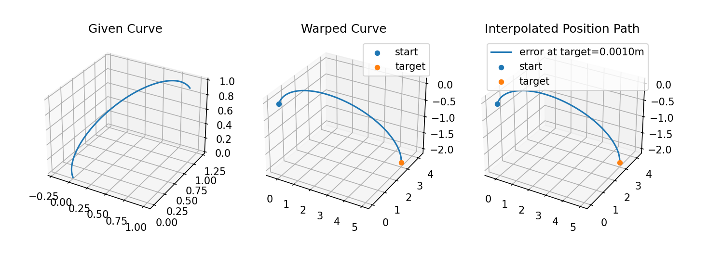
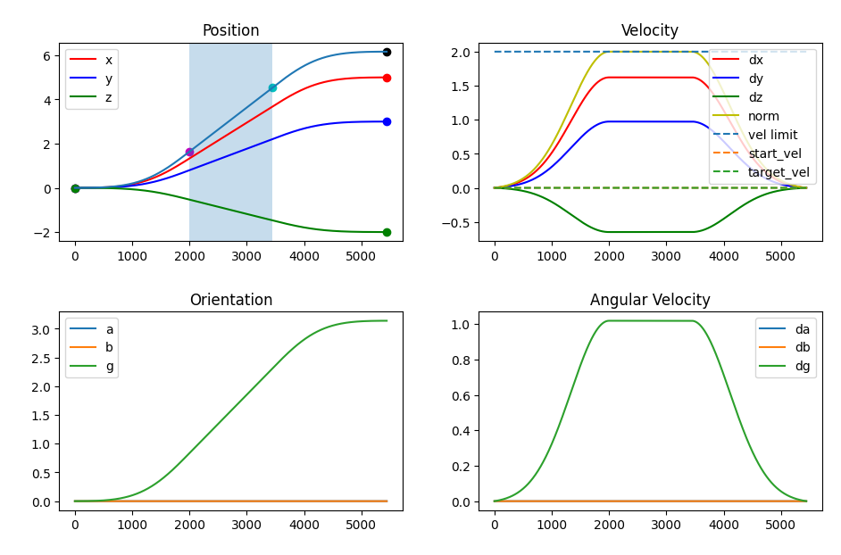

.. image:: https://imgur.com/4qIqbRn.jpg

***********
ABR Control
***********

The ABR Control library is a python package for the control and path planning of
robotic arms in real or simulated environments. ABR Control provides API's for the
Mujoco, CoppeliaSim (formerly known as VREP), and Pygame simulation environments, and
arm configuration files for one, two, and three-joint models, as well as the UR5 and
Kinova Jaco 2 arms. Users can also easily extend the package to run with custom arm
configurations. ABR Control auto-generates efficient C code for generating the control
signals, or uses Mujoco's internal functions to carry out the calculations.

ABR also provides an interface and config available for controlling a real Jaco 2
at the `ABR_Jaco2 <https://github.com/abr/abr_jaco2/>`_ repository.

Installation
============

The ABR Control library depends on NumPy, SymPy, SciPy, CloudPickle, Cython,
SetupTools, Nengo, and Matplotlib. We recommend using
`Anaconda <https://store.continuum.io/cshop/anaconda/>`_.
Note that installing in a clean environment will require compiling of the dependent
libraries, and will take a few minutes.

To install ABR Control, clone this repository and run::

    sudo apt-get install g++
    sudo apt-get install python-dev
    sudo apt-get install libfreetype6-dev
    conda activate your_environment
    pip install -e .

ABR Control is tested to work on Python 3.6+, Python 2 is not supported.

Optional Installation
=====================

Mujoco
------
If you would like to use the Mujoco API you will need to install a
forked version of `mujoco-py <https://github.com/studywolf/mujoco-py/>`_ with hooks for
exitting out of simulations with the ESC key. To use the mujoco API, make sure you are
in your anaconda environment and run::

    git clone https://github.com/studywolf/mujoco-py.git
    cd mujoco-py
    pip install -e .
    pip install glfw>=1.8.3
    pip install requests

Additionally, in Ubuntu 20.04 you will need::

    sudo apt install libomesa6-dev
    sudo apt install libglew-dev
    sudo apt install patchelf

and add the following line to your `~/.bashrc` file::

    export LD_PRELOAD=/usr/lib/x86_64-linux-gnu/libGLEW.so

Pygame
------
If you would like to use the Pygame API, from your anaconda environment run::

    pip install pygame

CoppeliaSim
----
We support CoppeliaSim <=4.2. You will need to download
`Vrep <http://coppeliarobotics.com/previousVersions/>`_ and follow the installation
instructions.

ABR Jaco2
----
In addition to simulation of the Kinova Jaco2 in CoppeliaSim and Mujoco, we have an
API for controlling the real arm. For installation instructions, see the
`ABR_Jaco2 <https://github.com/abr/abr_jaco2/>`_ repository.

Usage
=====

The ABR Control repo is comprised of four parts: 1) arms, 2) controllers, 3) path planners,
and 4) interfaces.

1a) Arms: Config files for CoppeliaSim, Pygame, or real arms
------------------------------------------------------------
All of the required information about an arm model is kept in that arm's config file.
To use the ABR Control library with a new arm, the user must provide a new config. For
CoppeliaSim, Pygame, or a real arm, the config must contain the transformation
matrices (written using SymPy expressions) from the robot's origin reference frame to
each link's centre-of-mass (COM) and joints. These are specified sequentially, e.g.
origin -> link0 COM, link0 COM -> joint0, joint0 -> link1 COM, etc. The arm config file
and any simulation code is kept in a folder named the same as the arm in the
``abr_control/arms/`` directory.

1b) Arms: Config files for Mujoco
---------------------------------
When using Mujoco the process is a bit different. Mujoco handles the calculation of all
the kinematics and dynamics functions, and only requires an xml config be made
describing the kinematic chain. The
`Mujoco API <http://www.mujoco.org/book/modeling.html>`_ page describes this in detail.

Detailed models can be created by importing 3D modeling stl files and using the
``mesh`` object type in the ``<geom>`` tag. An example of this is the
``abr_control/arms/jaco2/jaco2.xml``.  For users building their own models, you may
specify the location of the xml with the ``folder`` parameter. For more details, please
refer to the Mujoco documentation linked above and use the xml files in this repository
as examples.

For a detailed walk-through of how the ur5 mujoco model was built, see
`this tutorial <https://studywolf.wordpress.com/2020/03/22/building-models-in-mujoco/>`_

1c) Arms: Instantiation and transforms
--------------------------------------
The ABR Control configuration base class uses the SymPy transform matrices to provide
functions that will calculate the transforms, Jacobian, Jacobian derivative, inertia
matrices, gravity forces, and centripetal and Coriolis effects for each joint and COM.
There is also a base config class written for mujoco that has wrappers for these function
so that they can be accessed in the same way. This way your code should work between
various simulators with minimal changes requried. The different config files can be
instantiated as:

Pygame and CoppeliaSim::

    from abr_control.arms import jaco2 as arm

    # ur5, onelink, twolink, and threelink also available to import
    robot_config = arm.Config()

Mujoco::

    from abr_control.arms.mujoco_config import MujocoConfig as arm

    # 'ur5', 'onelink', 'twolink', and 'threelink' also available as arm_model's
    arm_model = 'jaco2'
    robot_config = arm.Config(arm_model)

ABR Jaco2 (real arm)::

    import abr_jaco2
    robot_config = abr_jaco2.Config()

The transforms can then be accessed from the instantiated robot config::

    # calculate the following given the arm state at joint_angles
    robot_config.Tx('joint3', q=joint_angles)  # the (x, y, z) position of joint3
    robot_config.M(q=joint_angles)  # calculate the inertia matrix in joint space
    robot_config.J('EE', q=joint_angles)  # the Jacobian of the end-effector

1d) Arms: Cython for real-time control
--------------------------------------
By default, the ``use_cython`` parameter is set to ``True`` to allow for real-time
control by generating optimized Cython code for each of the robot configuration
functions. This can take a little bit of time to generate these functions, but they
are saved in `~.cache/abr_control/arm_name/saved_functions` where they will be loaded
from for future runs. Note that a hash is saved for the config, so if any changes are
made the functions will be regenerated during the next use. The cython optimization can
be turned off on instantiation::

    from abr_control.arms import ur5

    robot_config = ur5.Config(use_cython=False)

Below are results from running the operational space controller with different
controllers with ``use_cython=True`` and ``False``.

.. image:: docs/examples/timing.png

2) Controllers
--------------
Controllers make use of the robot configuration files to generate control signals that
accomplish a given task (for most controllers this is reaching a target). The ABR
Control library provides implementations of several primary controllers, including
operational space, generalized coordinates (joint) space, sliding, and floating
control.

When using an operational space controller (OSC), it is possible to also pass in secondary
controllers to operate in the null space of the operational space controller. These
secondary controllers can be set up to achieve secondary goals such as avoiding joint
limits and obstacles, damping movement, or maintaining a configuration near a specified
resting state. Additionally, the OSC can be set to control any combination of the
6 controllable degrees of freedom of the end-effector. These are the end-effectors
x, y, z position, and a, b, g orientation.

There is also an implementation of nonlinear adaptive control in the ``controllers/signals``
folder, as well as examples in Mujoco, PyGame, and CoppeliaSim showing how this class
can be used to overcome unexpected forces acting on the arm. See the ``docs/examples``
folder for various use cases and examples of these controllers.

3a) Path Planners: generating a path
------------------------------------
In the ``controllers/path_planners`` folder there is a generalized path planner that can
be used in conjunction with the controllers to provide filtered via points to your target state.
This can greatly improve the stability of an arm's motion. The path planner can generate up to a
12 dimensional path that follows velocity and acceleration limitations. The path planner determines these limits
and the shape of the path to take by the position and velocity profiles passed on __init__.

The path planner has a ``generate_path()`` function that takes in start and target positons,
and a maximum velocity to travel. Optionally, start and target velocities (default 0 and 0)
and orientations can be passed in. The path planner will generate a trajectory from your desired
start to target positions (and optionally orientations). It will also discretize the path over
time such that it will be moving at the set start velocity at the begining of the path, and will
reach your target position and orientation while moving at your target velocity in that moment.
The path planner will use the velocity profile to accelerate from your ``start_velocity`` up to your
``max_velocity``, and back down to your ``target_velocity``. If the path to travel is too short
to reach the maximum velocity, the path planner will reach the maximum velocity it can before it
needs to begin decelerating to converge to your target state, while maintaining the desired path
shape. For longer paths the path planner will output a constant velcoity of ``max_velocity``
once that speed is reached, until it is time to decelerate.

The orientation path is planned using spherical linear interpolation (SLERP) to generate
a set of orientations from a start to a target orientation. The time profile will match
that of the path planner (ie: a linear velocity profile will have a linear step in orientation over
time, with a constant change in orientation, whereas a gaussian velocity profile will
have a bell shaped profile with the largest steps occurring during the middle of the
movement, with an acceleration and deceleration at the start and end, respectively.)

3b) Path Planners: position profiles
------------------------------------
The position profiles can be thought of as the general shape the path should follow. They contain
a ``step(t)`` function that outputs a 3D position in the domain of ``[0, 1]``. ``[0, 0, 0]`` and
``[1, 1, 1]`` are restricted to be the start and end of the path, which correspond to times ``0`` and
``1``, respectively. For a straight-line path this would be a straight line from ``[0, 0, 0]`` to
``[1, 1, 1]``. The path planner will rotate the position profile to align with the direction of
your ``target_position-start_position``, then translate and transform it to start and end at
the start and target positions.

.. image:: docs/examples/linear_position_profile.png

More complex shapes are available such as ellipse and sin curves are readily available, and custom
ones can be added with relative ease. For example, an ellipse profile can be followed, with an additonal
parameter than can adjust the stretching along the horizontal axis

3c) Path Planners: velocity profiles
------------------------------------
The velocity profiles are decoupled from the position profiles so that arbitrary low frequency shapes
can be defined, and the planned path will follow those shapes while maintaining physically
limited velocity and acceleration profiles. The velocity profiles have a ``generate()`` function
that outputs a list of velocities from a set start to target velocity. The various velocity_profiles
vary in their acceleration curves. For example, the ``velocity_profiles.Linear()`` class has a
constant acceleration from start to target.

.. image:: docs/examples/linear_path_linear_velocity.png

In comparison, the ``velocity_profiles.Gaussian()`` class has a smoothly changing velocity that
follows a gaussian curve.

4) Interfaces
-------------
For communications to and from the system under control, an interface API is used.
The functions available in each class vary depending on the specific system, but must
provide ``connect``, ``disconnect``, ``send_forces`` and ``get_feedback`` methods.

Putting everything together
---------------------------
A control loop using these four files looks like::

    import numpy as np

    from abr_control.arms import ur5 as arm
    from abr_control.controllers import OSC, Damping
    from abr_control.controllers.path_planners import PathPlanner
    from abr_control.controllers.path_planners.position_profiles import Linear
    from abr_control.controllers.path_planners.velocity_profiles import Gaussian
    from abr_control.interfaces import CoppeliaSim
    from abr_control.utils import transformations

    # Sim step size
    dt = 0.005

    # Initialize our robot config
    robot_config = arm.Config()

    # Damp the movements of the arm
    damping = Damping(robot_config, kv=10)

    # Create opreational space controller controlling all 6 DOF
    ctrlr = OSC(
        robot_config,
        kp=100,  # position gain
        ko=250,  # orientation gain
        null_controllers=[damping],
        vmax=None,  # [m/s, rad/s]
        # control all DOF [x, y, z, alpha, beta, gamma]
        ctrlr_dof=[True, True, True, True, True, True],
    )

    # Create our interface
    interface = CoppeliaSim(robot_config, dt=dt)
    interface.connect()

    # Create a path planner with a linear shape and gaussian velocity curve
    path_planner = PathPlanner(
        pos_profile=Linear(),
        vel_profile=Gaussian(dt=dt, acceleration=2)
    )

    # Get our starting state
    feedback = interface.get_feedback()
    hand_xyz = robot_config.Tx("EE", feedback["q"])
    starting_orientation = robot_config.quaternion("EE", feedback["q"])

    # Generate a target
    target_orientation = np.random.random(3)
    target_orientation /= np.linalg.norm(target_orientation)
    # convert our orientation to a quaternion
    target_orientation = [0] + list(target_orientation)
    target_position = [-0.4, -0.3, 0.6]

    starting_orientation = transformations.euler_from_quaternion(
        starting_orientation, axes='rxyz')

    target_orientation = transformations.euler_from_quaternion(
        target_orientation, axes='rxyz')

    # Generate our 12D path
    path_planner.generate_path(
        start_position=hand_xyz,
        target_position=target_position,
        start_orientation=starting_orientation,
        target_orientation=target_orientation,
        start_velocity=0,
        target_velocity=0,
        max_velocity=2
    )

    count = 0

    # Step through the planned path, with the OSC trying to
    # bring the end-effector to the filtered target state
    while count < path_planner.n_timesteps:
        # get arm feedback
        feedback = interface.get_feedback()
        hand_xyz = robot_config.Tx("EE", feedback["q"])

        next_target = path_planner.next()
        pos = next_target[:3]
        vel = next_target[3:6]
        orient = next_target[6:9]

        u = ctrlr.generate(
            q=feedback["q"],
            dq=feedback["dq"],
            target=np.hstack([pos, orient]),
            target_velocity=np.hstack([vel, np.zeros(3)])
        )

        # apply the control signal, step the sim forward
        interface.send_forces(u)

        count += 1

    interface.disconnect()

**NOTE** that when using the Mujoco interface it is necessary to instantiate and
connect the interface before instantiating the controller. Some parameters only get
parsed from the xml once the arm config is linked to the mujoco interface, which
happens upon connection. See Section 1 above for the difference in arm instantiation
for a Mujoco sim.

Examples
========

The ABR Control repo comes with several examples that demonstrate the use of the
different interfaces and controllers.

By default all of the PyGame examples run with the three-link MapleSim arm. You can
also run the examples using the two-link Python arm by changing the import statement at
the top of the example scripts.

To run the CoppeliaSim examples, have the most recent CoppeliaSim version open. By
default, the CoppeliaSim examples all run with the UR5 or Jaco2 arm model. To change
this, change which arm folder is imported at the top of the example script. The first
time you run an example you will be promted to download the arm model. Simply select
``yes`` to download the file and the simulation will start once the download completes.

To run the Mujoco examples, you will be promted to download any mesh or texture files,
if they are used in the xml config, similarly to the CoppeliaSim arm model. Once the
download completes the simulation will start. If you are using the forked Mujoco-Py
repository (See Optional Installation section) you can exit the simulation with the ESC
key and pause with the spacebar.
