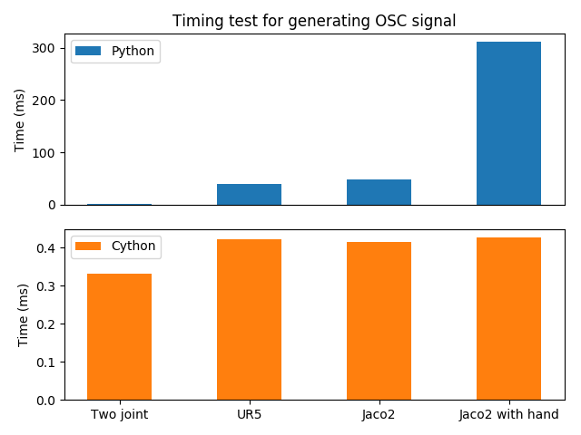

***********
ABR Control
***********

ABR_Control: Robotic arm control in Python

Installation
============

The ABR_Control library depends on NumPy, SymPy, SciPy, CloudPickle, and
Cython, and we recommend that you install these libraries before
ABR_Control. If you're not sure how to do this, we recommend using
`Anaconda <https://store.continuum.io/cshop/anaconda/>`_.
Note that installing in a clean environment will require compiling of the
dependent libraries, and will take a few minutes.

To install ABR_Control, clone this repository and run::

    sudo apt-get install g++
    sudo apt-get install python-dev
    sudo apt-get install libfreetype6-dev
    python setup.py install
    python setup.py develop

ABR_Control is tested to work on Python 3.4+, Python 2 is not supported.

Usage
=====

The ABR_Control repo is comprised of three parts: 1) arms, 2) controllers, and
3) interfaces.

1) All of the required information about an arm model is kept in that arm's
config file. To use the ÁBR_Control library with a new arm, the user must
provide the transformation matrices (written using SymPy expressions) from
the robot's origin reference frame to each link's centre-of-mass (COM) and
joints. These are specified sequentially, e.g.  origin -> link0 COM,
link0 COM -> joint0, joint0 -> link1 COM, etc. Additionally, the arm models
or simulation code is kept in the arm's folder.

The ABR_Control configuration base class uses the SymPy transform matrices
to provide functions that will calculate the transforms, Jacobian, Jacobian
derivative, inertia matrices, gravity forces, and centripetal and Coriolis
effects for each joint and COM. These can be accessed::

    from abr_control.arms import jaco2

    robot_config = jaco2.Config()
    robot_config.Tx('joint3', joint_angles)  # the (x, y, z) position of joint3
    robot_config.M(joint_angles)  # calculate the inertia matrix in joint space
    robot_config.J('EE', joint_angles)  # the Jacobian of the end-effector

For real-time control, the user may choose to generate optimized Cython code
for each of the robot configuration functions by setting the `use_cython`
parameter to `True`::

    from abr_control.arms import ur5

    robot_config = ur5.Config(use_cython=True)

Setting `use_cython=True` will also cause the generated functions to be cached,
minimizing startup time on future runs. Below are results from running the
operational space controller with different controllers using the Python and
Cython config functions.

2) The controllers make use of the robot configuration files to generate
control signals that drive the robot to a target. The ABR_Control library
provides implementations of several primary controllers, including operational
space, joint, sliding, and floating control.

There are also several implementations of secondary controllers designed to
operate in the null space of the operational space controller. These controllers
achieve secondary goals such as avoiding joint limits and obstacles, damping
movement, or maintaining a configuration near a specified resting state.

In the `path_planners` folder there are three path planners that can be used in
conjunction with the controllers. Two are filters on input targets, linear and
second order, which can be used to prevent the target from suddenly warping and
causing large spikes in generated torque. There is also an inverse kinematics
planner, which takes in a target for the end-effector and returns a joint angle
trajectory.

Finally, there is an implementation of nonlinear adaptive control in the
`signals` folder, as well as examples in both PyGame and VREP showing how this
class can be used to overcome unexpected forces acting on the arm.

3) For communications to and from the system under control, an interface class
is used. The functions available in each class vary depending on the specific
system, but must provide `connect`, `disconnect`, `send_forces` and
`get_feedback` methods.

A control loop using these three files looks like::

    from abr_control.arms import jaco2
    from abr_control.controllers import OSC
    from abr_control.interfaces import VREP

    robot_config = jaco2.Config()
    ctrlr = OSC(robot_config, kp=20,
                # control (x, y, z) out of [x, y, z, alpha, beta, gamma]
                ctrlr_dof=[True, True, True, False, False, False])
    interface = VREP(robot_config)

    interface.connect()

    target_xyz = [.2, .2, .5]  # in metres
    target_orientation = [0, 0, 0]  # Euler angles, relevant when controlled
    for ii in range(1000)
        feedback = interface.get_feedback()  # returns a dictionary with q, dq
        u = ctrlr.generate(
            q=feedback['q'],
            dq=feedback['dq'],
            target=np.hstack([target_xyz, target_orientation]))
        interface.send_forces(u)  # send forces and step VREP sim forward

    interface.disconnect()

Examples
========

The ABR_Control repo comes with several examples that demonstrate the use of
the different interfaces and controllers.

By default all of the PyGame examples run with the three-link MapleSim arm.
You can also run the examples using the two-link Python arm by changing the
import statement at the top of the example scripts. Note that to run the PyGame
examples, you will also need to install Pygame::

    pip install pygame

To run the VREP examples, have the most recent VREP version open, and load the
.ttt file from the corresponding `abr_control/arms/` folder for the arm of
interest. By default, the VREP examples all run with the UR5 or Jaco2 arm model.
To change this, change which arm folder is imported at the top of the example
script.
